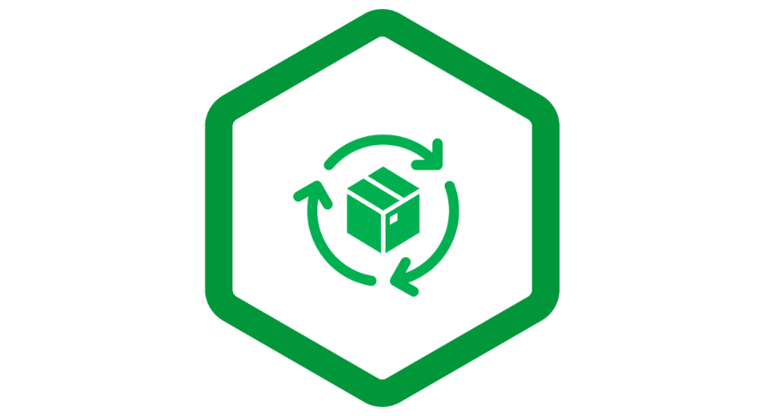

= What's dumpplane?
:toc: manual

*Dumpplane* provides cloud native configuration management for popular opensource software via 

. opensource software configuration *modeling* 
. customized *pipeline* to dump configuration to Real Time Data Store(MongoDB, ElasticSearch, BigTable)
. AI based Intelligent *App*

which enables Ops Manage and Govern Opensource with a Modern No-SQL Data Analysis/Observability/AIOps Way.

== Models

|===
|Opensource |Schema |Version

|Nginx
|link:models/dumpplane_model_nginx_0.0.1.json[dumpplane_model_nginx_0.0.1.json]
|0.0.1

|===

== Pipeline

[source, bash]
.*Install*
----
pip install dumpplane-0.0.1-py3-none-any.whl 
----

[source, bash]
.*Usage*
----
% dumpplane -h  
usage: dumpplane <command> [options]

various operations for nginx config files

optional arguments:
  -h, --help         show this help message and exit
  -V, --version      show program's version number and exit

commands:
  split              split a nginx dump(nginx -T) .conf to raw files
  dump               dump crossplane parsed .json to data storage
  help               show help for commands

----

To run `dumpplane`, you need make sure all link:docs/USERGUIDE.adoc#prerequisites-for-run-dumpplane[prerequisites for run dumpplane] are satisfied.

=== get

[source, bash]
----
$ ls pipeline/config/conf
nginx.conf_10.1.10.171	nginx.conf_10.1.10.195	nginx.conf_10.1.10.8
----

NOTE: `pipeline/config/conf` is folder, which contains 3 files, each file are output of `nginx -T`.

=== split

[source, bash]
----
$ dumpplane split pipeline/config/conf
----

=== parse

[source, bash]
----
for i in $(ls ~/.dumpplane/data/) ; do crossplane parse -o ~/.dumpplane/data/$i.json ~/.dumpplane/data/$i/nginx.conf ; done
----

NOTE: The *data* is dumpplane output file path, recommended crossplane output file are same as dumpplane output file path, or else you need specify `--input` while running dumpplane dump.

NOTE: Current crossplane parse output must equals `nginx -T` plus `.json`.

=== dump

[source, bash]
----
dumpplane dump pipeline/config/conf -o mongodb://127.0.0.1:27017 --db nginx --table configurations
----

This step will dump both `dumpplane` parsed result and `crossplane` parsed result as a single document to MongoDB database `nginx` and collection `configurations`.

NOTE: `nginx -T` output file name used as a primary key, which means if same file be dumped many times, only the 1st time is insert, the rest are upset.

NOTE: Run `dumpplane dump` with argument `-o http://localhost:9200 --db nginx` will index all configurations to ElasticSearch.

== Apps

=== Rate

Rate app is a link:https://en.wikipedia.org/wiki/Generic_cell_rate_algorithm[rate algorithm] based app that can make Opensource configuration management more intelligent.

1. The Ops define the configuration management rule via Excel(eg: link:apps/rate/rules/nginx-ops.xlsx[apps/rate/rules/nginx-ops.xlsx])
2. The `Rate app` load the rule and fire all facts from *pipeline* drived real time data store.

Refer to link:docs/DEVELOPERGUIDE.adoc#run-rate[Run Rate App] for more details  

=== SQL Aggregation

SQL Aggregation provide a series of SQL DML/DDL that can quick convert to real usage case scenrios.

Refer to link:docs/USERGUIDE.adoc#nginx-management-governance[NGINX Management & Governance] for more details.

== Contribute

. Fork and clone(git clone git@github.com:<YOUR_ID>/dumpplane.git)
. Do some changes or enhancement
. Summit your change(link:https://docs.github.com/en/pull-requests/collaborating-with-pull-requests/proposing-changes-to-your-work-with-pull-requests/about-pull-requests[about pull requests])
