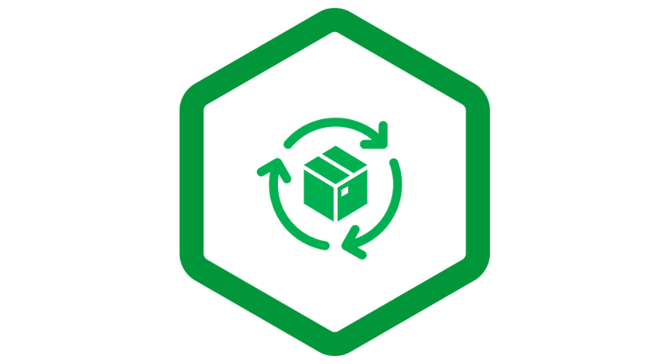
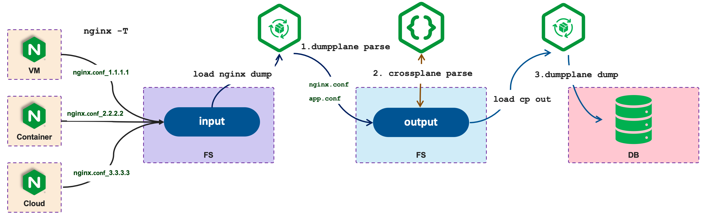

= NGINX Dump Plane
:toc: manual

== What's dumpplane?

The `dumpplane` is a tool work with link:https://github.com/nginxinc/crossplane[crossplane] to dump `nginx -T` results to MongoDB, which enables Ops Management and Governance NGINX with a modern Big No-SQL Data Analysis Way.

The `nginx -T` output should same to a file and copy to a directory, which used as input of `dumpplane` tool, then the `dumpplane` and `crossplane` will transfer `nginx -T` output to MongoDB finally.

[source, bash]
----
usage: dumpplane <commands> [options] [input]

commands:
  parse                 parse a nginx dump(nginx -T) file to raw object

  dump                  dump nginx crossplane result to mongodb

options:
  -h, --help            show this help message and exit
  -V, --version         show program's version number and exit
  --output              set dumpplane output file path. default data
  --cpout               set crossplane(https://github.com/nginxinc/crossplane) parse output file path. default same as dumpplane output
                            suggest crossplane commands is for i in $(ls data/) ; do crossplane parse -o data/$i.json data/$i/nginx.conf; done 
  --uri                 mongodb connection string, default mongodb://127.0.0.1:27017, refer to https://www.mongodb.com/docs/manual/reference/connection-string/ for details

input:
                        set nginx -T dump file directory, input is mandatory

----

== Prerequisites for run dumpplane

=== elasticsearch

This section including steps to setup Elasticsearch on local machine.

[source, bash]
----
docker network create elastic
docker pull docker.elastic.co/elasticsearch/elasticsearch:7.17.10
docker run --rm --name es01-test --net elastic -p 127.0.0.1:9200:9200 -p 127.0.0.1:9300:9300 -e "discovery.type=single-node" docker.elastic.co/elasticsearch/elasticsearch:7.17.10

docker pull docker.elastic.co/kibana/kibana:7.17.10
docker run --rm --name kib01-test --net elastic -p 127.0.0.1:5601:5601 -e "ELASTICSEARCH_HOSTS=http://es01-test:9200" docker.elastic.co/kibana/kibana:7.17.10
----

* http://localhost:5601

=== mongodb

This section including steps to setup MongoDB on local machine.

[source, bash]
.*1. Create DBpath*
----
mkdir nginx
----

[source, bash]
.*2. Start a single node mongodb*
----
mongod --dbpath nginx/
----

[source, bash]
.*3. connect to mongoDB via mongo shell*
----
$ mongosh 
Current Mongosh Log ID:	6455bd1f1642278a956b6a76
Connecting to:		mongodb://127.0.0.1:27017/?directConnection=true&serverSelectionTimeoutMS=2000&appName=mongosh+1.6.1
Using MongoDB:		6.0.3
Using Mongosh:		1.6.1
----

[source, bash]
.*4. Create db and collection*
----
use nginx
----

=== java

[source, bash]
.*Java Runtime time V11 or above version*
----
$ java --version
openjdk 18.0.1.1 2022-04-22
OpenJDK Runtime Environment (build 18.0.1.1+2-6)
OpenJDK 64-Bit Server VM (build 18.0.1.1+2-6, mixed mode, sharing)
----

=== crossplane

[source, bash]
.*link:https://github.com/nginxinc/crossplane[crossplane] 0.5.8 and above version*
----
$ crossplane --version
crossplane 0.5.8
----

== How to run?

In order to run `dumpplane`, you need make sure all link:#prerequisites-for-run-dumpplane[prerequisites for run dumpplane] are satisfied.

Refer blow steps to run `dumpplane`.

=== Step 1: prepare nginx dump file

[source, bash]
----
$ ls input/
nginx.conf_10.1.10.171	nginx.conf_10.1.10.195	nginx.conf_10.1.10.8
----

NOTE: `input` is folder, which contains 3 files, each file are output of `nginx -T`.

=== Step 2: dumpplane parse

[source, bash]
----
$ dumpplane parse input

split nginx.conf_10.1.10.171 to data/nginx.conf_10.1.10.171, total blocks: 6
split nginx.conf_10.1.10.8 to data/nginx.conf_10.1.10.8, total blocks: 8
split nginx.conf_10.1.10.195 to data/nginx.conf_10.1.10.195, total blocks: 58
----

=== Step 3: crossplane parse

[source, bash]
----
for i in $(ls data/) ; do crossplane parse -o data/$i.json data/$i/nginx.conf; done 
----

NOTE: The *data* is dumpplane output file path, recommended crossplane output file are same as dumpplane output file path, or else you need specify `--cpout` while running dumpplane dump.

NOTE: Current crossplane parse output must equals `nginx -T` plus `.json`.

=== Step 4: dumpplane dump

[source, bash]
----
$ dumpplane dump input

write nginx.conf_10.1.10.171 to DB was acknowledged, matched count: 0
write nginx.conf_10.1.10.8 to DB was acknowledged, matched count: 0
write nginx.conf_10.1.10.195 to DB was acknowledged, matched count: 0
----

This step will dump both `dumpplane` parsed result and `crossplane` parsed result as a single document to MongoDB.

NOTE: `nginx -T` output file name used as a primary key, which means if same file be dumped many times, only the 1st time is insert, the rest are upset.

=== Step 5: nginx management & governance

Refer to link:#nginx-management-governance[NGINX Management & Governance].

== NGINX Management & Governance

=== Total NGINX Host

[source, sql]
----
nginx> db.configurations.countDocuments()
31
----

=== NGINX Configration Files View

[source, sql]
.*SQL*
----
var pipeline = [
  {$addFields: 
    {
      status: '$crossplane.status',
      errors: '$crossplane.errors',
      config: '$crossplane.config'
    }
  }, 
  {
    $unwind: {
      path: '$config',
      includeArrayIndex: 'row',
      preserveNullAndEmptyArrays: true
    }
  }, 
  {
    $addFields: {
      fileStatus: '$config.status',
      content: '$config.parsed',
      filePath: '$config.file'
    }
  }, 
  {
    $project: {
      crossplane: 0,
      dumpplane: 0,
      config: 0
    }
  }
]
----

[source, sql]
.*Create View*
----
db.createView("configurationFiles", "configurations", pipeline)
----

=== Total NGINX Configration Files

[source, sql]
----
> db.configurationFiles.countDocuments()
154
----

=== Top 5 configuration files with the most configuration blocks

[source, sql]
.*SQL*
----
var pipeline = [
  {
    $addFields: {
      totalBlocks: {
        $size: '$content'
      }
    }
  }, 
  {
    $sort: {
      totalBlocks: -1
    }
  }, 
  {
    $limit: 5
  }, 
  {
    $project: {
      _id: 0,
      ngxHost: 1,
      filePath: 1,
      totalBlocks: 1
    }
  }
]
----

[source, sql]
.*Aggregate*
----
> db.configurationFiles.aggregate(pipeline)
[
  {
    ngxHost: '15.55.40.185',
    filePath: '/etc/nginx/conf.d/app.conf',
    totalBlocks: 11
  },
  {
    ngxHost: '104.3.42.121',
    filePath: '/etc/nginx/conf.d/app.conf',
    totalBlocks: 10
  },
  {
    ngxHost: '103.10.16.101',
    filePath: '/etc/nginx/conf.d/app.conf',
    totalBlocks: 9
  },
  {
    ngxHost: '10.1.10.195',
    filePath: '/etc/nginx/nginx.conf',
    totalBlocks: 9
  },
  {
    ngxHost: '10.1.10.171',
    filePath: '/etc/nginx/nginx.conf',
    totalBlocks: 6
  }
]
----

=== Top 5 NGINX hosts with the most number of configuration files

[source, sql]
.*SQL*
----
var pipeline = [
  {
    $group: {
      _id: '$ngxHost',
      count: {
        $count: {}
      }
    }
  }, 
  {
    $sort: {
      count: -1
    }
  },
  {
    $limit: 5
  } 
]
----

[source, sql]
.*Aggregate*
----
> db.configurationFiles.aggregate(pipeline)
[
  { _id: '10.1.10.195', count: 58 },
  { _id: '10.1.10.8', count: 8 },
  { _id: '10.1.10.171', count: 6 },
  { _id: '192.168.1.103', count: 3 },
  { _id: '10.1.10.103', count: 3 }
]
----

=== NGINX Configration Blocks View

[source, sql]
.*SQL*
----
var pipeline = [
  {
    $unwind: {
      path: '$content',
      includeArrayIndex: 'blockRow',
      preserveNullAndEmptyArrays: true
    }
  }, 
  {
    $addFields: {
      blockLineNumber: '$content.line',
      blockDirective: '$content.directive',
      blockArgs: '$content.args',
      blockIncludes: '$content.includes',
      subBlock: '$content.block'
    }
  }, 
  {$project: {
      content: 0
    }
  }
]
----

[source, sql]
.*Create View*
----
db.createView("configurationBlocks", "configurationFiles", pipeline)
----

=== Total NGINX Configration Blocks

[source, sql]
----
> db.configurationBlocks.countDocuments()
414
----

=== Total NGINX Configration http Blocks

[source, sql]
----
> db.configurationBlocks.find({ blockDirective: {$eq: "http"}}).count()
31
----

=== Total NGINX Configration stream Blocks

[source, sql]
----
> db.configurationBlocks.find({ blockDirective: {$eq: "stream"}}).count()
1
----

=== Total NGINX Configration server Blocks

[source, sql]
----
> db.configurationBlocks.find({ blockDirective: {$eq: "server"}}).count()
129
----

=== Total NGINX Configration upstream  Blocks

[source, sql]
----
> db.configurationBlocks.find({ blockDirective: {$eq: "upstream"}}).count()
53
----

=== NGINX Configration Directives View

[source, sql]
.*SQL*
----
var pipeline = [
  {
    $unwind: {
      path: '$subBlock',
      includeArrayIndex: 'directiveBlockLineNumber',
      preserveNullAndEmptyArrays: true
    }
  }, 
  {
    $addFields: {
      directiveBlockLineNumber: '$subBlock.line',
      directiveBlockDirective: '$subBlock.directive',
      directiveBlockArgs: '$subBlock.args',
      directiveBlockIncludes: '$subBlock.includes',
      directiveSubBlock: '$subBlock.block'
    }
  }, 
  {
    $project: {
      subBlock: 0
    }
  }
]
----

[source, sql]
----
db.createView("configurationDirectives", "configurationBlocks", pipeline)
----

=== Totoal NGINX Configration Directives

[source, sql]
----
> db.configurationDirectives.countDocuments()
3542
----

=== Top 5 Frequent Used Port

[source, sql]
.*SQL*
----
var pipeline = [
  {
    $match: {
      blockDirective: {
        $eq: 'server'
      },
      directiveBlockDirective: {
        $eq: 'listen'
      }
    }
  }, 
  {
    $addFields: {
      listenPort: {
        $arrayElemAt: ['$directiveBlockArgs', 0]
      }
    }
  }, 
  {
    $group: {
      _id: '$listenPort',
      count: {
        $count: {}
      }
    }
  }, 
  {
    $sort: {
      count: -1
    }
  }, 
  {
    $limit: 5
  }
]
----

[source, sql]
.*Aggregate*
----
> db.configurationDirectives.aggregate(pipeline)
[
  { _id: '8080', count: 14 },
  { _id: '9006', count: 6 },
  { _id: '9004', count: 6 },
  { _id: '9000', count: 6 },
  { _id: '9003', count: 5 }
]
----

=== NGINX go production configration validation

[source, sql]
.*1. Query all 3 host the the application go production related*
----
var pipeline = [
{
  $match: {
    $and: [
    {
      directiveBlockDirective: { $eq: 'location'}
    },
    {
      $or: [
      {
        ngxHost: {$eq: '10.55.140.71'}
      },
      {
        ngxHost: {$eq: '10.55.140.72'}
      },
      {
        ngxHost: {$eq: '10.55.140.73'}
      }
      ]
    }
    ]
  }
}, 
{
  $project: {
    _id: 0,
    ngxHost: 1,
    filePath: 1,
    blockDirective: 1,
    directiveBlockDirective: 1,
    configSize: {
      $size: '$directiveSubBlock'
    }
  }
}]
----

[source, sql]
.*2. Find the difference*
----
> db.configurationDirectives.aggregate(pipeline)
[
  {
    ngxHost: '10.55.140.72',
    filePath: '/etc/nginx/conf.d/app.conf',
    blockDirective: 'server',
    directiveBlockDirective: 'location',
    configSize: 2
  },
  {
    ngxHost: '10.55.140.73',
    filePath: '/etc/nginx/conf.d/app.conf',
    blockDirective: 'server',
    directiveBlockDirective: 'location',
    configSize: 1
  },
  {
    ngxHost: '10.55.140.71',
    filePath: '/etc/nginx/conf.d/app.conf',
    blockDirective: 'server',
    directiveBlockDirective: 'location',
    configSize: 2
  }
]
----

NOTE : Nginx on host `10.55.140.73` has 1 config items, the other has 2 items.

[source, sql]
.*3. SQL for find the configuration difference*
----
var pipeline = [
{ 
  $match: {
    $and: [
    { 
      directiveBlockDirective: { $eq: 'location'}
    },
    { 
      $or: [
      { 
        ngxHost: {$eq: '10.55.140.71'}
      },
      { 
        ngxHost: {$eq: '10.55.140.72'}
      },
      { 
        ngxHost: {$eq: '10.55.140.73'}
      }
      ]
    }
    ]
  }
},
{
   $unwind: {
     path: '$directiveSubBlock',
     includeArrayIndex: 'locationDirectiveRow',
     preserveNullAndEmptyArrays: true
  }
},
{
  $project: {
    _id: 0,
    ngxHost: 1,
    filePath: 1,
    blockDirective: 1,
    directiveBlockDirective: 1,
    locationDirectiveRow: 1,
    locationDirective: '$directiveSubBlock.directive',
    locationDirectiveArgs: '$directiveSubBlock.args'
  }
}
]
----

[source, sql]
.*4. Find the difference*
----
> db.configurationDirectives.aggregate(pipeline)
[
  {
    ngxHost: '10.55.140.72',
    filePath: '/etc/nginx/conf.d/app.conf',
    blockDirective: 'server',
    directiveBlockDirective: 'location',
    locationDirectiveRow: Long("0"),
    locationDirective: 'status_zone',
    locationDirectiveArgs: [ 'location_backend' ]
  },
  {
    ngxHost: '10.55.140.72',
    filePath: '/etc/nginx/conf.d/app.conf',
    blockDirective: 'server',
    directiveBlockDirective: 'location',
    locationDirectiveRow: Long("1"),
    locationDirective: 'proxy_pass',
    locationDirectiveArgs: [ 'http://backend' ]
  },
  {
    ngxHost: '10.55.140.73',
    filePath: '/etc/nginx/conf.d/app.conf',
    blockDirective: 'server',
    directiveBlockDirective: 'location',
    locationDirectiveRow: Long("0"),
    locationDirective: 'proxy_pass',
    locationDirectiveArgs: [ 'http://backend' ]
  },
  {
    ngxHost: '10.55.140.71',
    filePath: '/etc/nginx/conf.d/app.conf',
    blockDirective: 'server',
    directiveBlockDirective: 'location',
    locationDirectiveRow: Long("0"),
    locationDirective: 'status_zone',
    locationDirectiveArgs: [ 'location_backend' ]
  },
  {
    ngxHost: '10.55.140.71',
    filePath: '/etc/nginx/conf.d/app.conf',
    blockDirective: 'server',
    directiveBlockDirective: 'location',
    locationDirectiveRow: Long("1"),
    locationDirective: 'proxy_pass',
    locationDirectiveArgs: [ 'http://backend' ]
  }
]
----

NOTE: The `10.55.140.73` host lost the `status_zone` setting.

=== NGINX Configration locations View

[source, sql]
.*SQL*
----
var pipeline = [
  {
    $match: {
      directiveBlockDirective: {$eq: 'location' }
    }
  }, 
  {
    $unwind: {
      path: '$directiveSubBlock',
      includeArrayIndex: 'locationDirectiveRow',
      preserveNullAndEmptyArrays: true
    }
  }, 
  {
    $addFields: {
      locationDirective: '$directiveSubBlock.directive',
      locationDirectiveArgs: '$directiveSubBlock.args',
      locationDirectiveLine: '$directiveSubBlock.line'
    }
  }, 
  {
    $project: {
      directiveSubBlock: 0
    }
  }
]
----

[source, sql]
.*Create View*
----
db.createView("configurationLocations", "configurationDirectives", pipeline)
----

=== Totoal Locations

[source, sql]
----
> db.configurationLocations.countDocuments()
338
----

=== Find the Different Location Configrtaion

[source, sql]
----
> db.configurationLocations.find({$or: [{ngxHost: "15.55.140.71"}, {ngxHost: "15.55.140.72"}, {ngxHost: "15.55.140.73"}]},{_id: 0, ngxHost: 1, filePath: 1, blockDirective: 1, locationDirective: 1, locationDirectiveArgs: 1})
[
  {
    ngxHost: '15.55.140.72',
    filePath: '/etc/nginx/conf.d/app.conf',
    blockDirective: 'server',
    locationDirective: 'status_zone',
    locationDirectiveArgs: [ 'location_backend' ]
  },
  {
    ngxHost: '15.55.140.72',
    filePath: '/etc/nginx/conf.d/app.conf',
    blockDirective: 'server',
    locationDirective: 'proxy_pass',
    locationDirectiveArgs: [ 'http://backend' ]
  },
  {
    ngxHost: '15.55.140.73',
    filePath: '/etc/nginx/conf.d/app.conf',
    blockDirective: 'server',
    locationDirective: 'proxy_pass',
    locationDirectiveArgs: [ 'http://backend' ]
  },
  {
    ngxHost: '15.55.140.71',
    filePath: '/etc/nginx/conf.d/app.conf',
    blockDirective: 'server',
    locationDirective: 'status_zone',
    locationDirectiveArgs: [ 'location_backend' ]
  },
  {
    ngxHost: '15.55.140.71',
    filePath: '/etc/nginx/conf.d/app.conf',
    blockDirective: 'server',
    locationDirective: 'proxy_pass',
    locationDirectiveArgs: [ 'http://backend' ]
  }
]
----

